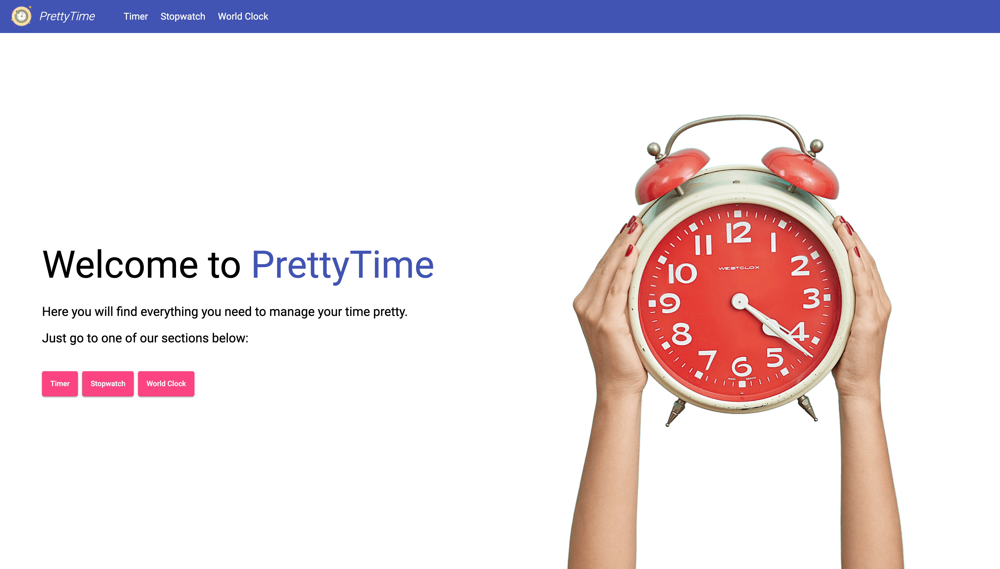
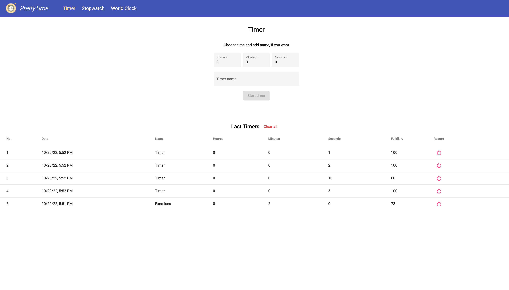
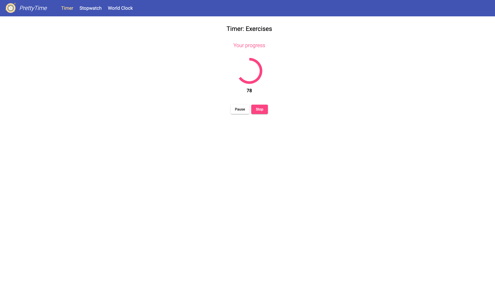
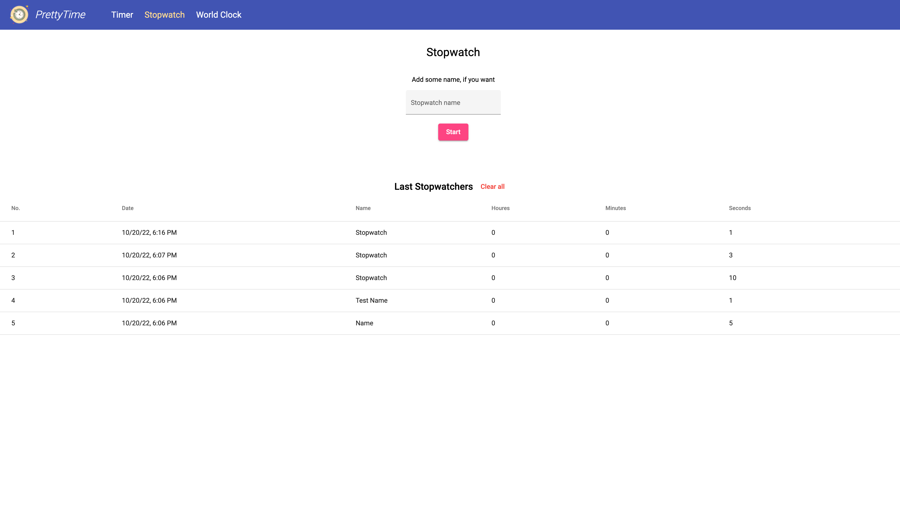
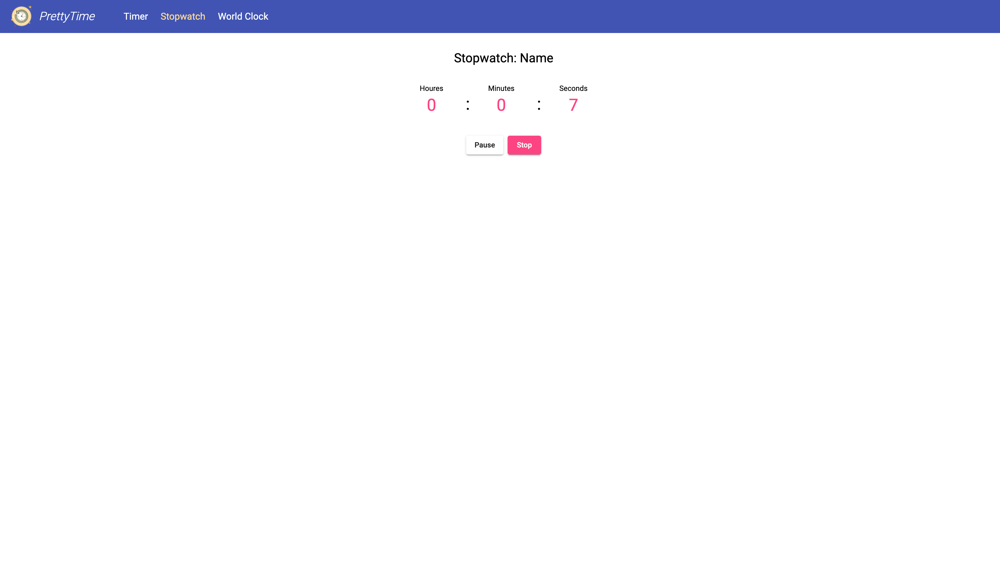
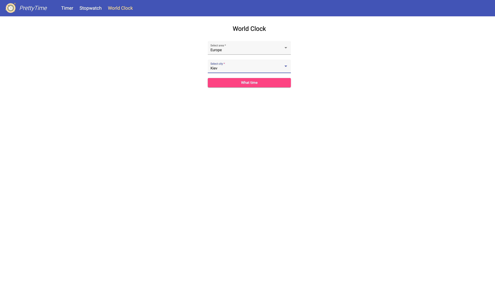
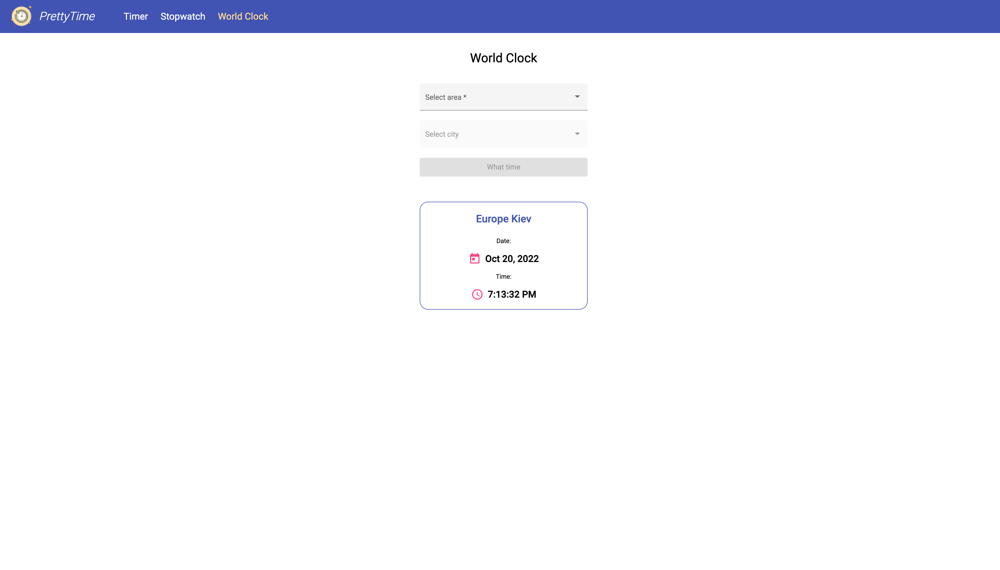

# PrettyTime
See demo by [this link](https://zoromari.github.io/pretty-time/) 

#### Functionality
Here you'll find all necessary features for working with time. 

#### Timer
You can start the Timer by choosing the amount of time you want and adding a custom name (if you need it). 
You will also have a table with the last 5 timers and basic information about them + you can restart each of them.

Once the timer has started, you can pause it, continue it, and stop it. When you go to the previous page, the last timer will automatically be saved in the table.

#### Stopwatch
You can start the Stopwatch by adding a custom name (if you need it). 
There is also a table with the last 5 stopwatches and information about their duration.

After begining you can also pause stopwatch, continue it, and stop it.

#### World Clock
You can check the time of every city around the world. Just select the area and city and you will get the information.

 

#### Technologies:
This project was generated with Angular CLI version 14.0.5. 
For this project, I used the Material components and theme. 

API for Exchange rates: http://worldtimeapi.org/
